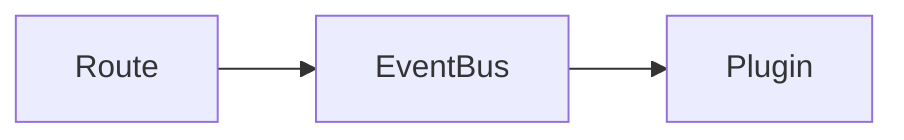

# Document Skill

Generate comprehensive, diagram-rich documentation for any codebase path.

## What This Skill Produces

Given a file path (repo root, subfolder, single module), this skill:

1. Recursively analyzes the code at that path
2. Produces a structured markdown document covering architecture, modules, data flows, and dependencies
3. Generates Mermaid diagrams for visual understanding (process flows, class relationships, DB schemas, infrastructure topology, etc.)
4. Converts diagrams to PNG via mermaid.ink
5. Saves everything to `docs/{target-name}/`

## Output Structure

```
docs/{target-name}/
  README.md              # The main documentation
  diagrams/
    {diagram-name}.mmd   # Mermaid source files (kept for future editing)
    {diagram-name}.png   # Rendered PNG images (referenced from README.md)
```

---

## Process

### Step 1: Understand the Target

Before analyzing anything, determine:

- What is the target path? (repo root, subfolder, single file)
- What kind of codebase is it? (API server, front-end app, library, IaC, lambda, etc.)
- What is its primary language/framework?
- Is there an existing README, package.json, or entry point that describes its purpose?

Read the top-level files first: `package.json`, `README.md`, entry points (`index.js`, `app.js`, `main.ts`, etc.), config files.

### Step 2: Recursive Analysis

Walk the directory structure and build a mental model:

**For each significant directory:**
- What is its purpose/concern?
- What are its key files and what do they do?
- What does it export or expose?
- What does it depend on (internal and external)?

**Identify these architectural elements (where applicable):**
- Entry points and initialization flow
- Route/endpoint definitions
- Service layer / business logic
- Data models / schemas / entities
- Configuration and environment dependencies
- External integrations (APIs, databases, queues, etc.)
- Event flows / pub-sub patterns
- Error handling patterns
- Testing structure

**For IaC / CloudFormation / CDK:**
- Stack hierarchy and nesting
- Resources defined per stack
- Cross-stack references and outputs
- IAM roles and policies
- Networking topology (VPC, subnets, security groups)
- Compute resources (EC2, Lambda, ECS)
- Storage and database resources
- CDN / load balancer configuration

**For Lambdas / Step Functions:**
- Trigger source (API Gateway, EventBridge, S3, SQS, etc.)
- Input/output shapes
- State machine definition (for step functions)
- Error handling and retry configuration
- Environment variables and their purpose

### Step 3: Write the Documentation

Structure the markdown document with these sections (adapt to what's relevant):

```markdown
# {Target Name}

> One-line description of what this is.

## Overview

2-3 paragraph summary: what this codebase does, its role in the larger system,
key technologies, and architectural style.

## Architecture

High-level architecture description with a diagram showing how the major
components relate.


## Directory Structure

Annotated tree showing the folder layout with brief descriptions of each
directory's purpose. Not every file — just the directories and key files
that matter.

## Key Modules

### {Module/Directory Name}

Description of what this module does, its responsibilities, key files,
and how it fits into the larger system.

(Repeat for each significant module)

## Data Flow

How data moves through the system. Include a sequence or flow diagram.


## Dependencies

### Internal Dependencies
What other repos/packages does this depend on?

### External Dependencies
Key npm packages, AWS services, third-party APIs.

## Configuration

Environment variables, config files, and what they control.

## Testing

How tests are organized, what test frameworks are used, how to run them.
```

Adapt this structure based on what's relevant. A front-end app needs different
sections than an IaC stack. Don't force sections that don't apply.

### Step 4: Generate Mermaid Diagrams

Create diagrams that genuinely aid understanding. Common diagram types:

- **Architecture / Component diagram** — how major pieces connect
- **Sequence diagram** — request flows, event chains
- **Entity-relationship diagram** — database tables and relationships
- **Class diagram** — service/entity relationships
- **Flowchart** — business logic flows, state machines
- **Infrastructure diagram** — cloud resource topology

Write each diagram as a fenced Mermaid block in the markdown first, then extract.

### Step 5: Extract and Render Diagrams

For each Mermaid diagram in the document:

1. Extract the Mermaid source to `diagrams/{name}.mmd`
2. Keep the fenced Mermaid code block inline in the markdown — it renders
   natively in VS Code, Notion, and other Mermaid-aware markdown viewers
   (Note: GitHub renders Mermaid in file views and issues/PRs; some other Markdown viewers don't render Mermaid at all)
3. Validate syntax by reviewing the Mermaid code for correctness before saving
4. **PNG conversion (when egress is available):** Use mermaid.ink to convert
   diagrams to PNG. Encode the diagram as base64 and fetch from
   `https://mermaid.ink/img/{base64}`. Save to `diagrams/{name}.png`.
   If egress is unavailable, skip PNG — the inline blocks are sufficient.
5. **Local PNG conversion (alternative):** If the user has `mmdc` installed
   locally (`brew install mermaid-cli`), they can batch-convert all `.mmd`
   files: `for f in diagrams/*.mmd; do mmdc -i "$f" -o "${f%.mmd}.png"; done`

The markdown should reference diagrams like this:

~~~markdown
### Architecture



*Source: [diagrams/architecture.mmd](diagrams/architecture.mmd)*
~~~

This gives two layers of access (three when PNGs are available):
- **Inline rendering** in GitHub, VS Code, Notion, and other Mermaid-aware viewers
- **`.mmd` source files** for future editing, diffing, or batch conversion
- **`.png` files** (optional) for embedding in contexts that don't render Mermaid

### Step 6: Verify

After generating the documentation:

- Confirm the README.md is well-structured and readable
- Confirm all `.mmd` source files were created
- Confirm all inline Mermaid blocks are syntactically valid
- If PNGs were generated, confirm image references point to valid files
- Read through the document for accuracy — don't describe code you haven't read

---

## Guidelines

- **Read the code, don't guess.** Every claim in the documentation must come from actually reading the source. If a file is too large to read in full, read the exports, the constructor/init, and the public interface.

- **Depth over breadth.** It's better to thoroughly document the important modules than to shallowly list every file. Focus on what someone needs to understand to work in this codebase.

- **Diagrams should earn their place.** Don't create a diagram just to have one. Each diagram should reveal a relationship or flow that's hard to see from reading code alone.

- **Keep diagrams simple.** A diagram with 30 nodes is worse than no diagram. Break complex systems into multiple focused diagrams.

- **Don't document node_modules, dist, build artifacts, or generated files.**

- **Note what you couldn't analyze.** If something requires runtime inspection, database access, or credentials you don't have, say so rather than guessing.

- **Use the codebase's own terminology.** Don't rename concepts. If the code calls it a "helper", call it a "helper" in the docs.
